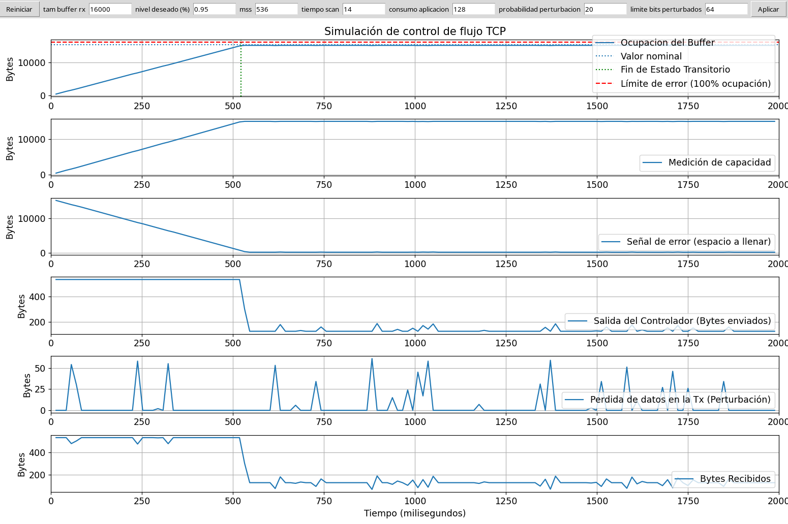

# Simulación de Control de Flujo TCP

## Características

- Simulación animada del buffer receptor y el controlador TCP.
- Gráficas en tiempo real de diferentes variables del sistema.
- Modificación de parámetros desde la interfaz mediante casillas de texto.

## Requisitos

- Python 3
- matplotlib
- tkinter

## Uso

1. Clona el repositorio
2. Instala los requisitos:
```sh
pip install matplotlib
```
3. Ejecuta la aplicación:

```sh
python3 main.py
```

3. Usa la interfaz para ajustar los parámetros y observar el comportamiento del sistema.

## Captura de Pantalla



